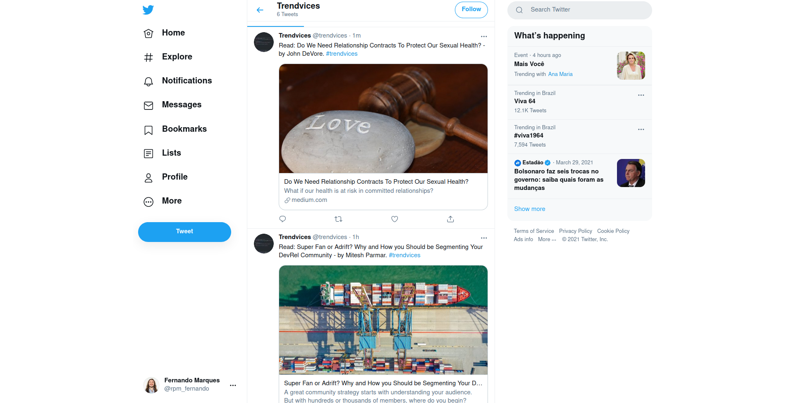
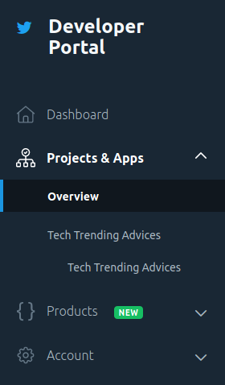
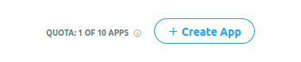
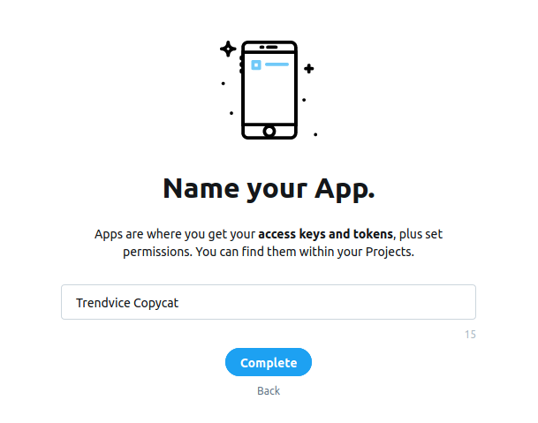
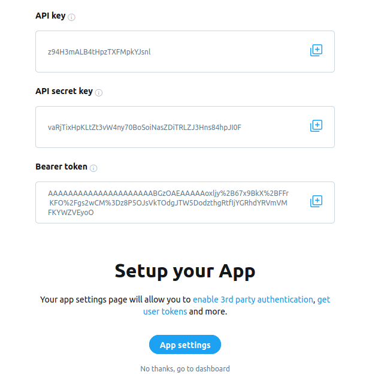
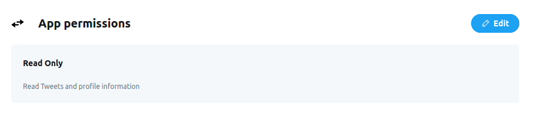
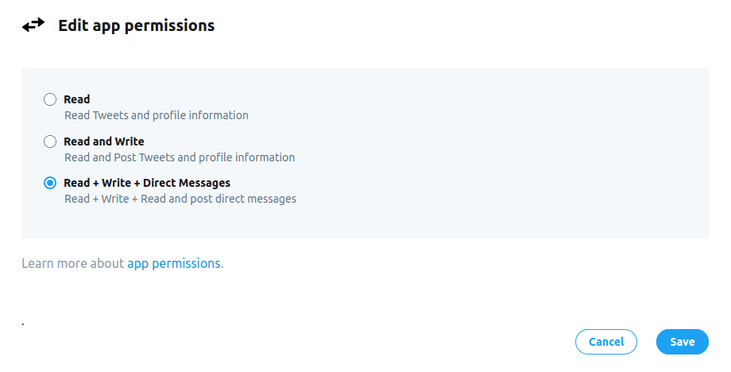
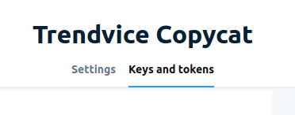
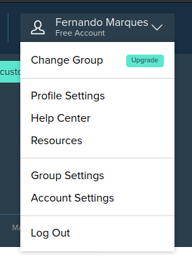
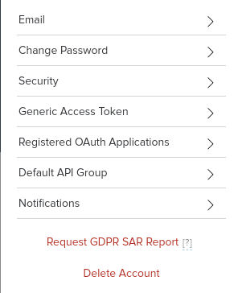

# Trendvices

> Trendvices is a twitter bot that you should follow for your daily dose of tech news, tips and advice. Built with ruby



These are some example posts from the Trendvices Bot!


## Built With

- Ruby
- Unique gems: twitter, bitly, httparty, nokogiri
- Twitter Dev Tools
- Bitly Dev Tools

## Live Demo

[Live Demo Link](https://livedemo.com)


## Getting Started

### Prerequisites

- Ruby
- Bundler
- Ruby on Rails
- Node.js
- Yarn (v >= 1.2 && < 2)

### Setup
> You'll need a config folder/directory with the auth keys for both twitter and bitly. It's highly advised that you follow the entire setup.

#### Github
- Create a new folder/directory for the project
- Be sure to have a Github account and that this account is connected locally on your PC

#### Twitter 

You're going to need auth keys for this. If you already know how to do it, just jump to the next section.

<details><summary>Setting up Twitter for Devs</summary>
<p>

#### Create an account/Login into [Twitter for Developers](https://developer.twitter.com/)
#### You'll have to fill a form with the reason behind your requesting for creating a developer account
#### Create a new project by going into 'Projects & Apps' > 'Overview'

#### Then clicking on the 'Create App' button

#### Type the desired app name and click 'Complete'

#### Ignore the keys for now. Go right ahead to the 'App settings'

#### Click on the 'Edit' button of the 'App permission' settings - your app is going to tweet, so it needs POST auth as well!

#### Select 'Read + Write + Direct Messages' and hit 'Save'

#### Now on the top of the dashboard, go to the 'Keys and Tokens' tab

#### Regenerate both API key & secret and Access Token & secret - **REMEMBER TO NEVER SHARE THEM**

## Now, go to your project folder/directory
#### Create a folder/directory named `config`
#### Create a file named `twitter_auth.rb`
#### Paste this code below, but remember to change YOUR_KEY with the according key:

```ruby
module Trendvices
  class TwitterAuth
    attr_reader :api_key, :api_secret_key, :access_token, :access_token_secret

    def initialize
      @api_key = 'YOUR_KEY'
      @api_secret_key = 'YOUR_KEY'
      @access_token = 'YOUR_KEY'
      @access_token_secret = 'YOUR_KEY'
    end
  end
end

```

#### IMPORTANT: NEVER COMMIT THE CONFIG FOLDER TO A PROJECT!!!


</p>
</details>


#### Bitly

You're going to need your auth key for this. If you already know how to do it, just jump to the next section.

<details><summary>Setting up Bitly Auth</summary>
<p>

#### Create an account/Login into [Bitly](https://app.bitly.com/)
#### Click on your name on the top right corner of the dashboard, and click on 'Profile Settings'

#### Then click on the 'Generic Access Token' button

#### Enter your password and click on the 'Generate' button - REMEMBER TO NEVER SHARE THEM

## Now, go to your project folder/directory
#### Create a folder/directory named `config` (if you haven't already)
#### Create a file named `bitly_auth.rb`
#### Paste this code below, but remember to change YOUR_KEY with the according key:

```ruby
module Trendvices
  class BitlyAuth
    attr_reader :access_token

    def initialize
      @access_token = 'YOUR_KEY'
    end
  end
end

```

#### IMPORTANT: NEVER COMMIT THE CONFIG FOLDER TO A PROJECT!!!


</p>
</details>


#### Medium
- Nothing has to be done here, since it's just a simple data scraper. Medium is just the Article website that we scrape the data from. It's both the HTTParty and the Nokogiri that are doing the heavy lifting here.


### Install

If you want to make sure that all of the gems used are included (to avoid any errors later on):
- `gem install twitter`
- `gem install bitly`
- `gem install httparty`
- `gem install nokogiri`

Run these commands in this order:

To clone the project into your computer:
- `git clone https://github.com/fernandorpm/trendvices.git`

Go to the newly created directory/folder:
- `cd trendvices`

To install the gems from the Gemfile:
- `bundle install`

### Usage

Creating a robot for twitter that is able to scrap data. It can be changed to interact with twitter in many different ways. Please refer to the [Twitter Developer Documentation](https://developer.twitter.com/en/docs)

### Run

On the folder/directory of the project:
- `bin/main.rb`

### Test

In order to run the tests, first you have to have the rspec gem installed in your PC.
For that, run `gem install rspec`

Then you can check if the rspec was succesfully installed by running `rspec --version`.

Finally, just as for the previous steps, you have to go to the project location on your computer.

Then, you have to go to the testing folder (`cd testing`) and run `rspec`.

You can manipulate and check the tests on the following files, located in ./testing/spec:
- `bitly_manager_spec.rb`
- `medium_manager_spec.rb`
- `twitter_manager_spec.rb`


## Authors

👤 **Fernando R P Marques**

- GitHub: [@fernandorpm](https://github.com/fernandorpm)
- Twitter: [@rpm_fernando](https://twitter.com/rpm_fernando)
- LinkedIn: [Fernando R P Marques](https://linkedin.com/in/fernandorpm)

## 🤝 Contributing

Contributions, issues, and feature requests are welcome!

Feel free to check the [issues page](../../issues/).

## Show your support

Give a ⭐️ if you like this project!

## 📝 License

This project is [MIT](./MIT.md) licensed.
